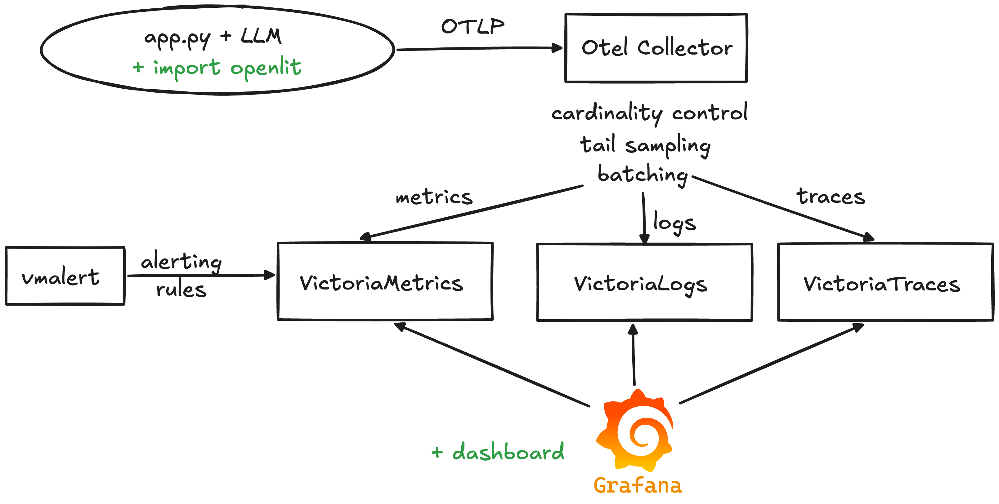
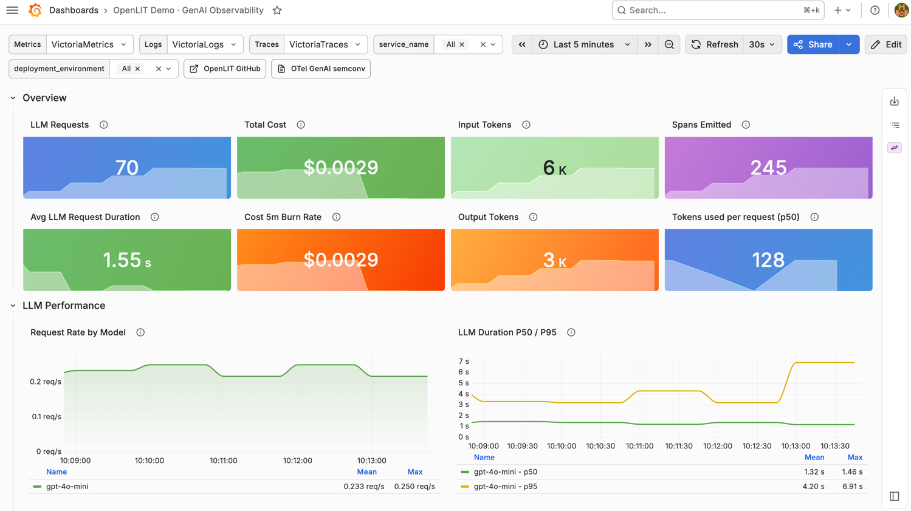
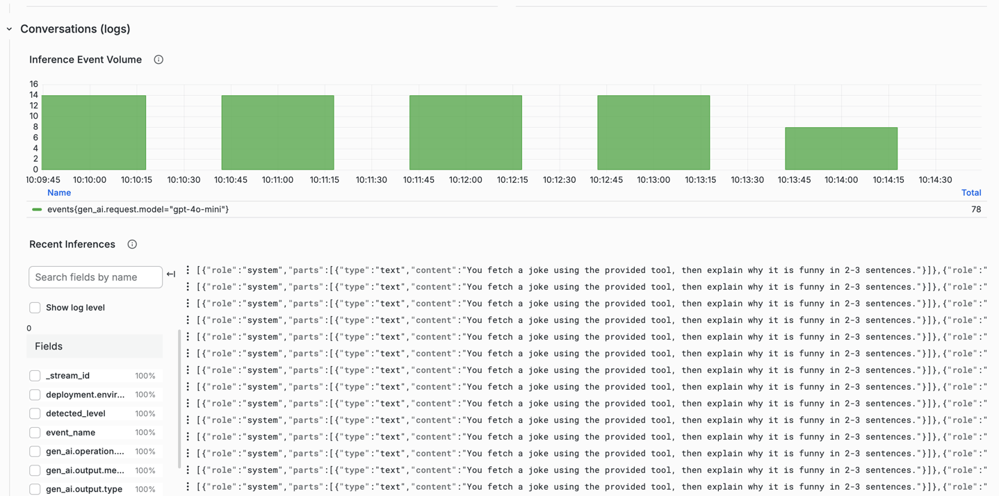
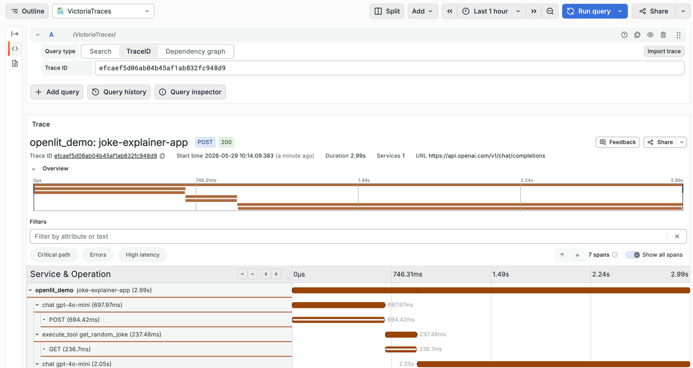
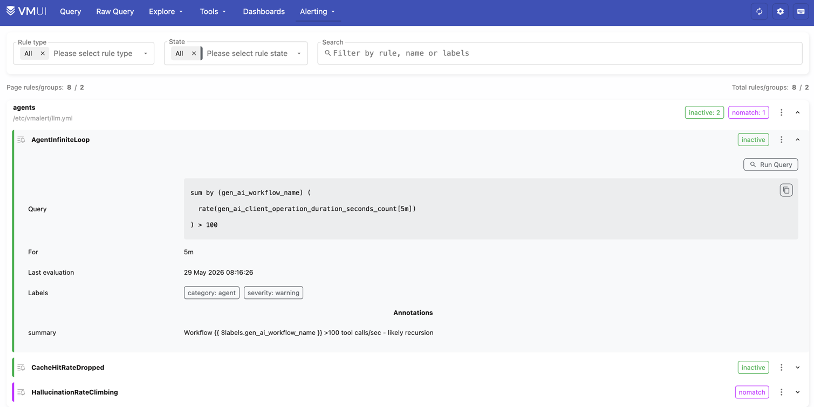

# AI Observability

This is a demo project to demonstrate how to monitor AI applications by emitting metrics, logs and traces via [Openlit SDK](https://github.com/openlit/openlit)
via [OpenTelemetry collector and VictoriaStack](https://docs.victoriametrics.com/opentelemetry/).

See also a [demo project for GPU observability](https://github.com/hagen1778/gpu-observability).

## Architecture

The demo consists of the following components:



1. [Python application](https://github.com/hagen1778/ai-observability/blob/main/openlit-demo.py) that uses OpenAI integration
   for chat completions and [openlit SDK](https://github.com/openlit/openlit) for LLM observability.
2. Openlit SDK forwards collected telemetry to OpenTelemetry collector via HTTP.
3. OpenTelemetry collector performs basic transofrmations, tail sampling, etc. and forwards telemetry to VictoriaStack.
4. VictoriaStack is represented as:
   - VictoriaMetrics for metrics
   - VictoriaLogs for logs
   - VictoriaTraces for traces
5. Grafana provisioned with:
   - [datasources for metrics, logs and traces](https://github.com/hagen1778/ai-observability/tree/main/provisioning/datasources)
   - [dashboard for AI observability](https://github.com/hagen1778/ai-observability/blob/main/provisioning/dashboards/openlit-demo.json)
6. vmalert for running basic [alerting and recording rules](https://github.com/hagen1778/ai-observability/blob/main/rules/llm.yml) against VictoriaMetrics.

See the [compose.yml](https://github.com/hagen1778/ai-observability/blob/main/compose.yml) for the full list of services.

## Quickstart

Start the observability stack via docker-compose:
```sh
docker compose up -d
```

The docker-compose runs all the services except the Python application:
1. VictoriaMetrics available at http://localhost:8428/
2. VictoriaLogs available at http://localhost:9428/
3. VictoriaTraces available at http://localhost:10428/
4. Grafana available at http://localhost:3000/

> Please verify you have mentioned HTTP ports opened locally when running docker-compose.

Once the observability stack is up, let's run the Python application:
```sh
OTEL_RESOURCE_ATTRIBUTES="team=growth" OPENAI_API_KEY="" OPENAI_BASE_URL="" .venv/bin/python3 openlit-demo.py 
```

This Python application integrates with OpenAI to generate random jokes and explain them. It expects `OPENAI_API_KEY`
to be set for the integration to work:
```sh
OTEL_RESOURCE_ATTRIBUTES="team=growth" .venv/bin/python3 openlit-demo.py                                                                                     :(
------
The joke plays on the double meaning of "strong" by referring to the two weekend days that are typically associated with leisure and freedom compared to the workdays. The punchline cleverly contrasts the "strong" sense of enjoyment and relaxation that Saturdays and Sundays provide against the mundane and often burdensome weekdays, creating an amusing observation about our weekly routines.
------
The joke "What kind of dinosaur loves to sleep? A stega-snore-us." is funny because it plays on the name of a well-known dinosaur, the stegosaurus, and cleverly combines it with the word "snore," which humorously suggests that the dinosaur is lazy or sleepy. The humor lies in the pun that transforms a scientific name into a playful and relatable trait—snoring—which we associate with people who are in a deep sleep. This blending of concepts creates an amusing image that catches the listener off guard.
```
Application runs constantly, spending tokens and emitting telemetry. **Press Ctrl+C to stop it.**

After a few minutes the application was running, it should have emitted telemetry to VictoriaStack.
Open the Grafana and navigate to the [provisioned dashboard](https://github.com/hagen1778/ai-observability/blob/main/provisioning/dashboards/openlit-demo.json):






Check the alerting and recording rules by visiting [Alerting page](http://localhost:8428/vmui/?#/rules):
